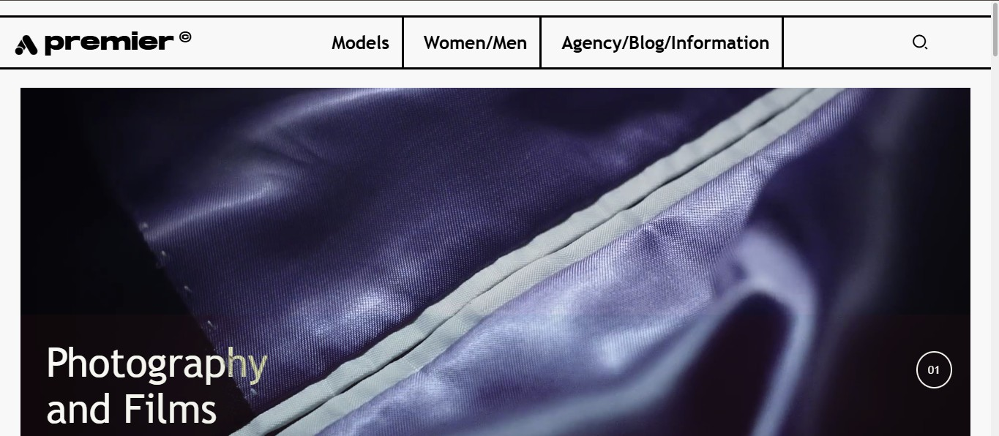
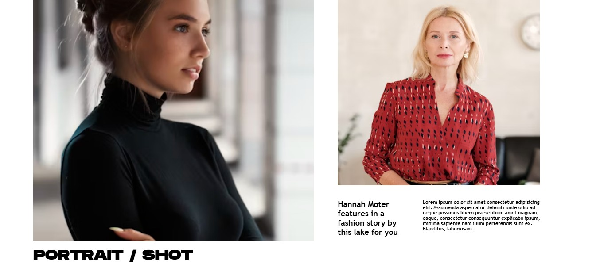
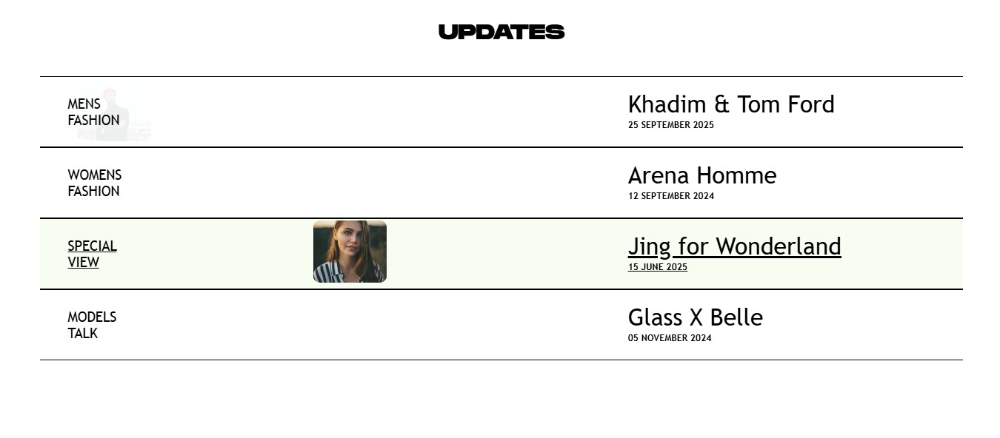
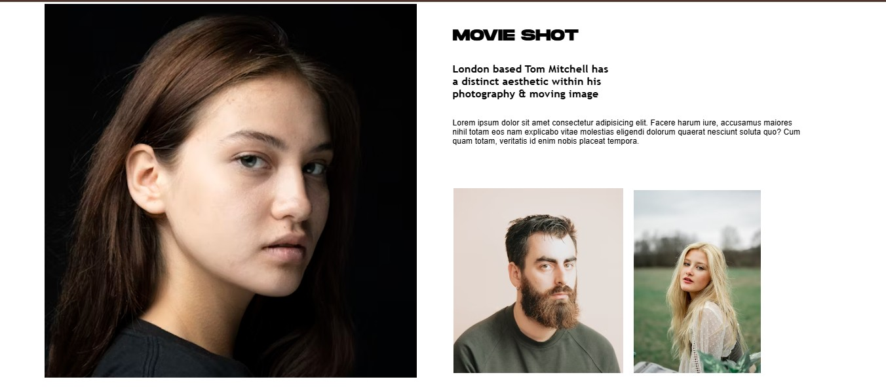

# Premier — Portfolio / Creative Website

[Live Demo →](https://sachinsaini7.github.io/premier/)

A stylish, responsive, and minimal website built to showcase creative work — models, photography, editorial content — with smooth interactions, immersive layouts, and aesthetic visual storytelling.

---

## 🎥 Demo / Preview

## ✨ Features

- Fully responsive design (desktop, tablet, mobile)  
- Hero banner, image galleries, distinct content sections  
- Smooth scrolling & transition effects  
- Modular layout for sections like “Women / Men”, “Models”, “Blog / Updates / Info / Contact”  
- Clean, semantic HTML + CSS + vanilla JavaScript  
- No dependencies — pure frontend, easily hostable on GitHub Pages  

---

## 🗂️ Project Structure

/
├── index.html
├── styles.css
├── assets/
│ └── (all image assets,fonts, icons, additional supporting files)
└── README.md

Copy code

- **index.html** — main landing/front page  
- **css/** — all styles, responsive rules, layout, animation  
- **js/** — interactive scripts (scroll, transitions, toggles, etc.)  
- **images/** — all visual media used by the site  
- **assets/** — fonts, icons, other supporting files  

---

## 🛠️ Technologies Used

- HTML5 & CSS3  
- CSS Flexbox, CSS Grid, Media Queries  
- Vanilla JavaScript  
- small animations / scroll logic  

## 📷 Screenshots / Demo

  
*Homepage view with banner and hero section*

  
*Grid / layout of models*

  
*Grid / layout of models*

  
*Grid / layout of models*

  
*Footer, contact, info blocks*

---

🚀 Getting Started (Local Setup)
To run and develop locally:

Clone the repo

bash
Copy code
git clone https://github.com/your-username/premier.git
Enter the directory

bash
Copy code
cd premier
Open index.html in your web browser

Or run a simple local server, e.g.

bash
Copy code
python3 -m http.server
Or use VS Code’s Live Server extension

Make edits to HTML, CSS, JS — refresh to see changes

🎯 Future Ideas & Enhancements
Add a contact form (with backend or serverless function)

Add filtering, sorting, or a dynamic gallery

Use a headless CMS or JSON data to drive content

Add more animations / scroll reveal / parallax layers

Improve accessibility (keyboard navigation, ARIA labels)

Add dark mode switch

📝 License
This project is open source under the MIT License — see the LICENSE file for details.

👤 Author
Sachin Saini — creator & designer

GitHub: @sachinsaini7

Feel free to open issues, suggest improvements, or contribute!
